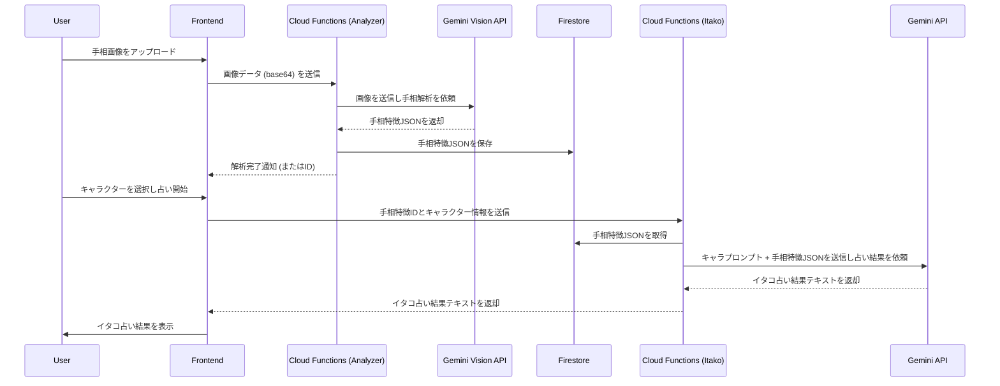

# 🔮 手相イタコ占いアプリ - 基本設計書

## 概要

本ドキュメントは、「手相イタコ占いアプリ」のシステム設計に関する基本事項を記述します。
全体のシーケンス、データ構造、API仕様を明確にすることで、開発の指針とします。

---

## 1. 全体シーケンス図

ユーザーが手相画像をアップロードしてから、イタコ占い結果が表示されるまでの一連の流れをMermaid記法で記述します。

---

## 2. Firestore データ構造（スキーマ）

アプリで使用するFirestoreのコレクションとドキュメントのデータ構造を定義します。

### コレクション: `readings`

手相解析結果と占い結果を保存するコレクション。

| フィールド名 | 型 | 説明 | 例 |
|---|---|---|---|
| `id` | string | ドキュメントID (自動生成) | `reading_abc123` |
| `timestamp` | timestamp | 作成日時 | `2026-06-01T10:00:00Z` |
| `handImageRef` | string | 手相画像のストレージパス | `readings/reading_abc123/hand_image.jpg` |
| `analysisResult` | map | Gemini Vision APIによる手相解析結果 | `{ "lifeLine": "long", "headLine": "clear", ... }` |
| `character` | string | 選択されたイタコキャラクター | `徳川家康` |
| `itakoResult` | string | イタコ占い結果テキスト | `そなたの運命はかくかくしかじかである...` |
| `status` | string | 処理ステータス (`pending`, `analyzed`, `completed`, `error`) | `completed` |

---

## 3. Cloud Functions API仕様

Cloud Functionsのエンドポイント、入力、出力を定義します。

### 3.1. 手相解析API

-   **関数名:** `analyzeHand`
-   **エンドポイント:** `/api/analyzeHand` (例: `https://your-project-id.cloudfunctions.net/analyzeHand`)
-   **HTTPメソッド:** `POST`

#### 入力 (Request Body)

| フィールド名 | 型 | 必須 | 説明 |
|---|---|---|---|
| `imageData` | string | Yes | Base64エンコードされた手相画像データ |

#### 出力 (Response Body)

| フィールド名 | 型 | 説明 | 例 |
|---|---|---|---|
| `success` | boolean | 処理の成功/失敗 | `true` |
| `readingId` | string | 新規作成された手相解析結果のドキュメントID | `reading_abc123` |
| `message` | string | 処理結果メッセージ | `Hand analysis initiated successfully.` |
| `error` | string | エラー発生時のエラーメッセージ | `Invalid image data.` |

---

### 3.2. イタコ占いAPI

-   **関数名:** `getItakoReading`
-   **エンドポイント:** `/api/getItakoReading` (例: `https://your-project-id.cloudfunctions.net/getItakoReading`)
-   **HTTPメソッド:** `POST`

#### 入力 (Request Body)

| フィールド名 | 型 | 必須 | 説明 |
|---|---|---|---|
| `readingId` | string | Yes | 解析済みの手相結果のドキュメントID |
| `character` | string | Yes | 選択されたイタコキャラクター名 |

#### 出力 (Response Body)

| フィールド名 | 型 | 説明 | 例 |
|---|---|---|---|
| `success` | boolean | 処理の成功/失敗 | `true` |
| `itakoResult` | string | イタコ占い結果のテキスト | `そなたの運命はかくかくしかじかである...` |
| `message` | string | 処理結果メッセージ | `Itako reading generated successfully.` |
| `error` | string | エラー発生時のエラーメッセージ | `Reading not found.` |
